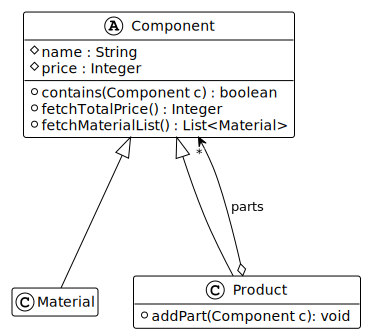
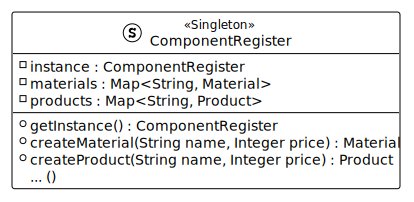
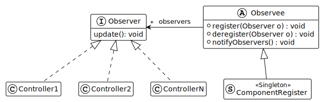

# Parts List Management with Java Swing
This repository contains an application to manage components.
It may be used
* to show an overview of all components.
* create new Components (Products or Materials).
* list all Materials of a given Product.

Its entrypoint is [Application.java](src/main/java/org/hawhamburg/Application.java).

---

The application showcases different programming patterns:

### Composite Pattern
A [Component](src/main/java/org/hawhamburg/model/composite/Component.java) is either a
[Product](src/main/java/org/hawhamburg/model/composite//Product.java) or a
[Material](src/main/java/org/hawhamburg/model/composite/Material.java).
A _Product_ may contain other _Components_ via its _parts_ aggregation,
while a _Material_ is an atomic _Component_.

### Singleton
The [ComponentRegister](src/main/java/org/hawhamburg/model/singleton/ComponentRegister.java)
serves as the storage and Single Point Of Truth for all existing _Components_.

### Observer Pattern
Some [Controller classes](src/main/java/org/hawhamburg/controller), that control corresponding views of the GUI,
rely on updates coming from the [ComponentRegister](src/main/java/org/hawhamburg/model/singleton/ComponentRegister.java)
to always show the latest information.
So, _Controllers_ are [Observers](src/main/java/org/hawhamburg/observerwithevents/observer/Observer.java)
and the _ComponentRegister_ is an [Observee](src/main/java/org/hawhamburg/observerwithevents/observer/Observee.java).

### Observer Pattern with Events and Visitor
//TODO

### State Pattern
//TODO
